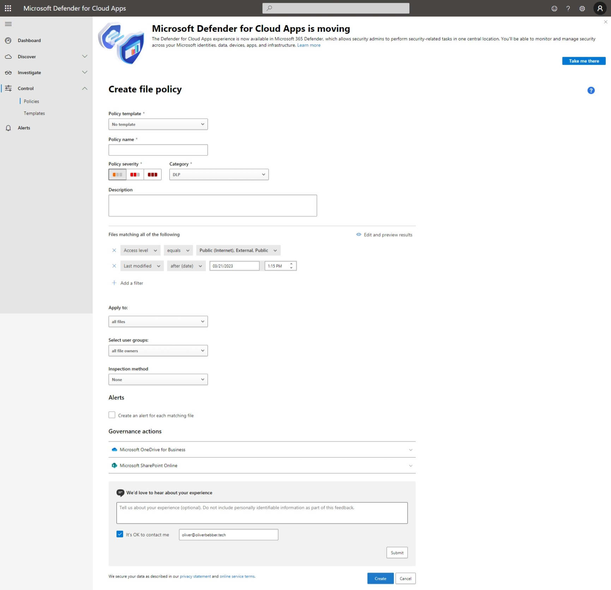

# Implement data loss prevention

# Create and configure data loss prevention (DLP) policies

Microsoft Purview Data loss prevention (DLP) features can be used to help protect and manage sensitive data.

When creating DLP policies, you should create use cases, scenarios, and end-user personas for the different types of data in the org. 

The following are examples of questions to ask:

- What type of data needs protection?
    - Credit card numbers
    - SSNs
    - Addresses (both physical and email)
    - Acquisition negotiations

- What format is our data in?
    - PDF
    - Office documents (.docx, .xlsx)
    - Custom file format 

- Where are the files located?
    - Email
    - Cloud services
    - SharePoint
    - OneDrive 
    - USB drives, external hard drives, etc.

- How are files currently created, maintained, and archived?
    - Generated through a scheduled report
    - Data in transit via a workflow ticketing process
    - Maintained in the cloud or on-prem storage
    - Past project data is archived in file or server storage

DLP policies can be used to help in a number of areas:

- Block sending emails containing bank account information or SSNs
- Require emails to be encrypted
- Block uploading, downloading, or sharing sensitive information from the cloud
- Applying Rights Management service (RMS) on SharePoint libraries that host the documents

## Recommend a DLP solution for an organization

## Configure permissions for DLP

## Create, test, and tune DLP policies

## Configure DLP for policy and rule precedence

## Configure DLP policies for Microsoft Exchange Online, Microsoft SharePoint Online, Microsoft OneDrive, Microsoft Teams, Microsoft Power BI, and on-premises repositories

## Configure DLP policies for use in Microsoft Defender for Cloud Apps

Defender for Cloud Apps has a built-in DLP engine that performs content inspect by extracting text from over 100 common file types.  The engine combines three aspects under each policy:

- Content scanned based on preset templates or custom expressions
- Context filters including user roles, file metadata, sharing level, org group integration, collaboration context, and additional custom attributes
- Automated actions for governance and remediation

Once enabled, the policy will continuously scan the cloud environment to identify files that match the filters, and applies the requested, automated actions. Policies will detect and remediate violations for information at-rest, or when new content is created. These policies can also be monitored using real-time alerts or use console generated reports.

You can also use the Data Classification Service which is configured in Microsoft Purview's compliance portal. This option allows for a uniform experience across all configured DLP policies.

## Configure file policies in Microsoft Defender for Cloud Apps to use DLP policies

From the <a href=https://portal.cloudappsecurity.com>Defender for Cloud Apps portal</a>, select Control, then Policies.

From the Policies page, we will click on + Create policy, then click on File policy from the dropdown menu.

If you want to use a Policy template, select one from the dropdown menu, otherwise, name the policy.

**Policy template options:**

- File shared with unauthorized domain
- Externally shared source code
- File containing PII detected in the cloud (built-in DLP engine)
- File containing PHI detected in the cloud (built-in DLP engine)
- File containing PCI detected in the cloud (built-in DLP engine)
- Stale externally shared files
- File shared with personal email addresses
- Shared digital certificates (file extensions)

Set the Policy severity:

- Low severity
- Medium severity
- High severity

**Note:** if you have Defender for Cloud Apps to send notifications on policy matches for a specific severity level, make sure to configure new policies that will allow for the notifications to function properly with your new policy.

Select the Category for your new policy and link it to the most appropriate risk type:

- Threat detection
- Privileged accounts
- Compliance
- DLP
- Cloud Discovery
- Sharing control
- Access control
- Configuration control

**Note:** This field is informative only and will help you search for specific policies and alerts based on risk type. 

- By default, File policies are set to DLP.

Give the policy a description.

Create a filter for the files the policy should act on to determine which discovered apps will trigger the policy.

For example:

- App equals Active Directory
- App equals Microsoft Online Services
    - This option will select Microsoft Online Services and the all nested options.
- App equals Office 365
- App equals Microsoft OneDrive for Business
- App equals Microsoft SharePoint Online

Note: Be as restrictive as possible to avoid false positives. If you want to remove public permissions, make sure to add the Public filter. If you want to remove external users, make sure to use the External filter.

To only allow users within the org to have access:

- App equals Microsoft SharePoint Online
- Access level equals Internal

Next, we will need to select what files this policy applies to.

- All files
- All files excluding selected folders
- Selected folders

To enforce this policy on specific folders within Box, SharePoint, Dropbox, or OneDrive, use the Selected folders option. Then click Add folder(s). This will prompt you to log into the cloud app and select the desired folders.

**Note:** If this is the first time you are configuring Defender for Cloud Apps File policies, you may need to enable file monitoring. A popup will appear instructing you to do this. Be aware, this will require leaving the page and any changes will be discarded.

- If you want to monitor Office 365 files, you need to enable that in the Office 365 connector.

Then we will want to Select the user groups this policy applies to.

- All file owners
- All file owners excluding selected user groups
- File owners from selected user groups

**Note:** If this is the first time configuring Defender for Cloud Apps, you will need to import user groups from connected apps. For more information, <a href="https://learn.microsoft.com/en-us/defender-cloud-apps/user-groups">Import User Groups from Connected Apps</a>

Next, we will select the content Inspection method. 

- None
- Built-in DLP [legacy]

If you wish to have an alert created for each file matching the policy, be sure to select the checkbox under Alerts.

Choose the Governance actions you want Defender for Cloud Apps to take when a match is determined, then click Create.

# Implement and monitor Microsoft Endpoint DLP

## Create and maintain DLP policies for endpoints

## Configure endpoint DLP settings

## Specify a deployment method for device onboarding

## Identify endpoint requirements for device onboarding

## Monitor endpoint activities

## Implement Microsoft Purview Extension

# Analyze and respond to data loss prevention policies and activities

## Analyze data loss prevention reports

## Analyze data loss prevention activities by using Activity explorer

## Remediate data loss prevention policy violations in the Microsoft Purview compliance portal

## Remediate data loss prevention violations in Microsoft Defender for Cloud Apps